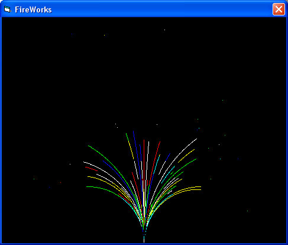



## Firework

### Description

Show firework in motion
 
### More Info
 

             |
---                |---
**Submitted On**   |2003-04-10 20:14:22
**By**             |[Kenneth Jakobsen\_](https://github.com/Planet-Source-Code/PSCIndex/blob/master/ByAuthor/kenneth-jakobsen.md)
**Level**          |Advanced
**User Rating**    |4.0 (8 globes from 2 users)
**Compatibility**  |VB 6\.0
**Category**       |[Graphics](https://github.com/Planet-Source-Code/PSCIndex/blob/master/ByCategory/graphics__1-46.md)
**World**          |[Visual Basic](https://github.com/Planet-Source-Code/PSCIndex/blob/master/ByWorld/visual-basic.md)
**Archive File**   |[Firework1576914202003\.zip](https://github.com/Planet-Source-Code/kenneth-jakobsen-firework__1-44898/archive/master.zip)

### API Declarations

SetpixelV - for putting pixels faster onto screen.

